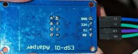

# Noaton-DF-4112-EspHome-config
This is my config I am using to control my air dehumidifier through EspHome with Homeassistant. The device has full support for a wifi module (tuya). It even has a LED (unlabeled on the case) indicating the presence of the wifi module. Just connect an esp with a level shifter between to the [wifi port](pcb.jpg) of the mainboard (be careful, theres 230V around! Unplug the device first). To access the board, remove the black ring at the top, remove some screws and another cover above the PCB. The connector is labeled "WIFI".

Parts needed:
- JST PH 2.0mm connector
- ESP-01S (+ programmer)
- 3.3V/5V level shift board 

- connectors for the level shift board (to the cable of the JST connector)
- a case for the esp (https://www.thingiverse.com/thing:6611175)

Watch out the wiring between the WIFI port and the level shift board.

The config file supports all features, a few ones (not relevant to me) are not properly configured.

